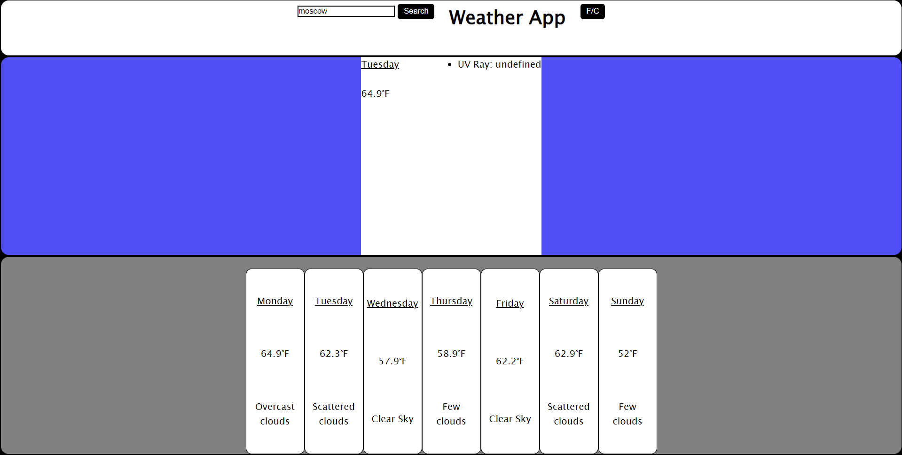

# Special-weather-app
Group project weather app.

https://apilist.fun/out/geonames-api (api to fetch specific locations)

https://apilist.fun/out/openuv (api to fetch daily UV forcast)

https://apilist.fun/out/weatherbit (api to fetch weather data)

# Special Group Project:

In this project, you will find a simple weather app, utilizing two api's, one which fetches basic weather data, and the other which gets the uv ray forecast.

## Instructions on Use:

* Open the application

* In the upper left hand corner you'll find a location search bar.

* Enter your location like this (location, state).

* Weather data will automatically be customized based on the location entered.

*You can click on the button in the upper right hand corner to change the temperature from celsius to fahrenheit.

## Acceptance Criteria

* The UI is easy to understand and well laid out.

* User can easily input their location, and diplayed data will change accordingly.

* When changing temperature from celsius to fahrenheit, the data is correct, and easy to understand.

## Sample Page
* The following screenshot is provided as an image of the final user UI: 

## 💡 Notes

Working in a team, we created a simple weather app. This app utilizes two api's, uv ray information, and weather, in order to function. Aditionally, we created a nifty button to easily change the displayed temperature data from imperial to the metric system.

//basic MIT license//
